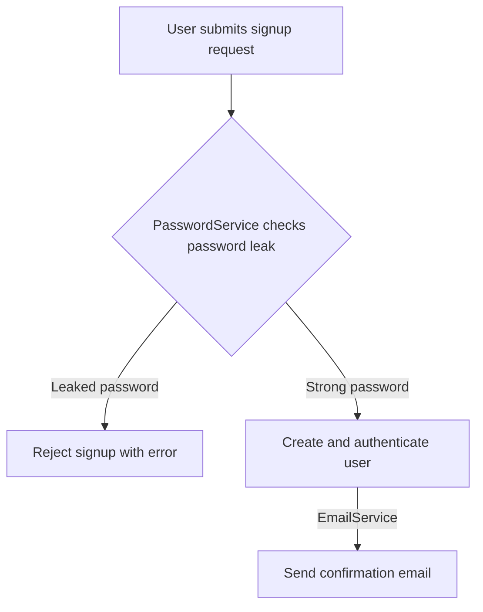

# Description

[Nest](https://github.com/nestjs/nest) example showcasing how to test unmanaged dependencies - highly inspired by Vladimir Khorikov's Book and [article](https://enterprisecraftsmanship.com/posts/when-to-mock/).

This project covers a basic scenario of signing up a user with two possible outcomes (so far):

```gherkin
Feature: Sign up

  Scenario: A user signs up successfully
    When a user signs up with email "new-user@mail.com" and password "password"
    Then they are authenticated
    And they should receive an email with subject "Welcome".

  Scenario: A user sign up fails due to leaked password
    Given the password "weak" has leaked in a rainbow table
    When a user tries to sign up with the email "new-user@mail.com" and password "weak"
    Then they receive an error message: "Your password has leaked in a data breach. Please choose a different one."
```

To send the email, we utilize an `EmailService`, and to verify whether a password is leaked we use a `PasswordService`. Both are **unmanaged** dependencies because our system does not have control over their state.



## Project setup

```bash
$ pnpm install
```

## Running Requests

You can explore and run requests using [Bruno](https://www.usebruno.com/), an open-source alternative to postman. The advantage is that it saves collections in the same repository as the code.

```bash
$ pnpm run start:dev # First, bootstrap the server
$ pnpm run requests # Run all requests
```

## Compile and run the project

```bash
# development
$ pnpm run start

# watch mode
$ pnpm run start:dev

# production mode
$ pnpm run start:prod
```

## Run tests

```bash
# unit tests
$ pnpm run test

# e2e tests
$ pnpm run test:e2e

# test coverage
$ pnpm run test:cov
```
